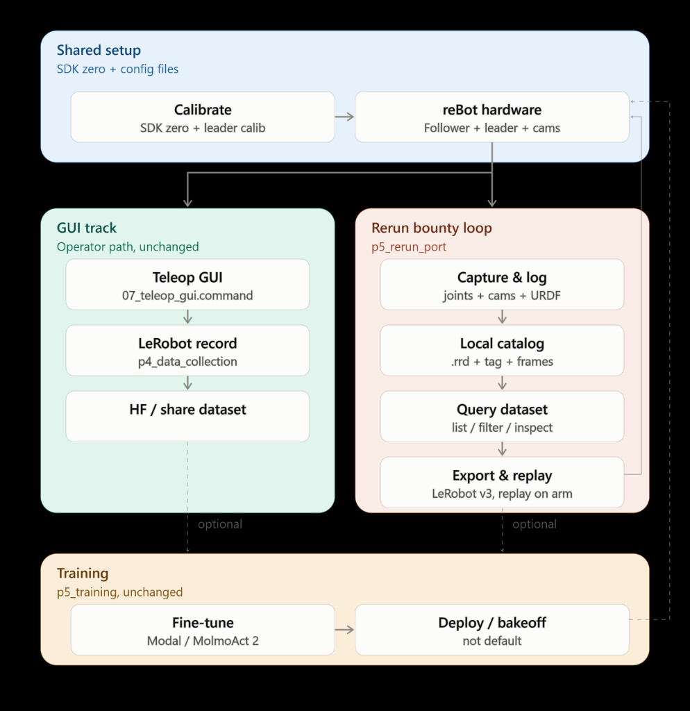

# DeskPartner

A reBot B601-DM robot arm that clears a desk zone on its own. An overhead camera photographs the zone, a vision language model decides what each object is and where it belongs, and the arm picks it up and puts it there, re-checking after every pick until the zone is clear.

🏅 Honorable Mention at the [Embodied Metal Hackathon](https://luma.com/embodied-metal?tk=J10GoD), San Francisco, July 17 to 19 2026, hosted by Mission Robotics, New Theory, Savant, and North Star. Built by a team of five over one weekend.



## Results

We ran on reBot hardware rather than the SO-101 that the rest of the room used. The follower has seven joints where the SO-101 has six, so the Rerun and LeRobot tooling had to be ported rather than configured.

- Recorded 102 teleop attempts and kept 77. The 25 rejected attempts, 17 aborted plus 5 collector errors plus 3 explicit failures, were archived as native `.rrd` recordings with operator labels instead of deleted, which is what made the quality gate below possible.
- Published the kept work as two pinned Hugging Face datasets: 52 episodes and 36,729 frames of single-can sorting, 25 episodes and 14,478 frames of two-can recycling. 77 episodes and 51,207 frames at 30 FPS in total, every sample carrying seven action values, seven observed joint values, and `front` and `side` video.
- Fine-tuned SmolVLA locally on Apple Silicon, warm-started from `lerobot/smolvla_base` rather than trained from scratch. See [`SMOLVLA_TRAINING.md`](./SMOLVLA_TRAINING.md).
- Fine-tuned MolmoAct 2 on Modal through LeRobot's native policy path, action-expert-only on an L4. The can-sort smoke batch trained 5 episodes from loss 0.115 to 0.071 in about five minutes. See [`p5_training/RUN_MOLMOACT.md`](./p5_training/RUN_MOLMOACT.md).
- Built a Rerun Query API quality gate that decides which operator-approved demonstrations are eligible for training. The pinned regression ran over all 77 episodes and 51,207 frames with zero action-limit rejects, computing 65 scalar metrics and 33 per-joint vectors per episode.
- Ported the whole Rerun loop to a seven-joint non-SO-101 arm: log, record, catalog and query, LeRobot v3 export. Replay on the physical follower was verified in dry run only.
- Submitted the port to three Rerun bounty tracks: non-SO-101 end-to-end port, Query API, and Viewer integration.

The task narrowed during the event. The plan in [`docs/GROUND_TRUTH.md`](./docs/GROUND_TRUTH.md) was crumpled paper into a trash bin; by Saturday the recorded and trained task was picking one can into a taped sorting zone. [`docs/TEAM.md`](./docs/TEAM.md) is the source of truth for what was actually built.

## Team

Five people. The `p1` to `p5` folder names are the original Friday split and were deliberately not renamed when roles were reassigned on Saturday, because renaming mid-event breaks everyone's imports.

| Area | Code | Track |
|------|------|-------|
| Arm and motion | [`p1_arm_motion/`](./p1_arm_motion/) | A |
| Vision and calibration | [`p2_vision_calibration/`](./p2_vision_calibration/) | A |
| VLM orchestrator and run loop | [`p3_vlm_orchestrator/`](./p3_vlm_orchestrator/) | A |
| Teleop and data collection | [`p4_data_collection/`](./p4_data_collection/) | B |
| Policy training and bake-off | [`p5_training/`](./p5_training/) | B |
| Rerun port and bounty | [`p5_rerun_port/`](./p5_rerun_port/) | Bounty |
| macOS operator GUI | [`rebot_operator_kit/`](./rebot_operator_kit/) | Tooling |

Track A was the scripted pipeline that had to ship. Track B was the learned policy, scoped so it could be cut without touching the demo. Each area has matching docs under [`docs/`](./docs/README.md).

## What was hard

The first teleop demonstrations were not usable. Stock `lerobot-record` drove the motor control loop at the dataset frame rate and stored the leader-space command rather than the follower-space action actually sent to the arm, so takes were sluggish to drive and the recorded action did not match what the robot did. We replaced it with our own collector, [`rebot_operator_kit/teleop_gui/controlled_record.py`](./rebot_operator_kit/teleop_gui/controlled_record.py), which separates the two clocks: leader and follower run at 240 Hz while cameras and dataset samples are stored at 30 FPS, and every sample pairs one follower observation with the follower-space action sent on that same control tick. We also made discarding the default, which is why roughly a quarter of all attempts never reached training. Jerky-but-successful takes were rejected alongside the misses, failed takes were archived for review rather than deleted, and goal-versus-position error in Rerun flagged teleop lag and dropped frames before anything reached export.

---

# Setup and operation

**Ground truth / SOW:** [`docs/GROUND_TRUTH.md`](./docs/GROUND_TRUTH.md)
**Hardware deck:** [ReBot Arm Workshop](https://docs.google.com/presentation/d/1LXgehBvwPy5EhWO7aaYQffvmlN4eS1zFmJWYoDcTm-c/edit)
**Config:** single-arm follower and leader. Track B trained two policy routes: SmolVLA locally on Apple Silicon, and MolmoAct 2 on Modal.

## Repo layout

```
DeskPartner/
├── README.md                # this file
├── docs/                    # SOW, team, track guides, bounty progress
├── config/                  # arm, cameras, workspace, destinations
├── shared/                  # handoff types & fake fixtures for parallel work
├── scripts/                 # host setup helpers
├── p1_arm_motion/           # Track A: IK pick/drop, party tricks
├── p2_vision_calibration/   # Track A: ArUco, CV, pixel→arm
├── p3_vlm_orchestrator/     # Track A: VLM + closed-loop state machine
├── p4_data_collection/      # Track B: teleop demos (LeRobot, single-arm only)
├── p5_training/             # Track B: policy fine-tune + bake-off
├── p5_rerun_port/           # Rerun bounty: log/record/query/export/replay
└── rebot_operator_kit/      # macOS GUI: teleop, two-camera collection, review
```

**Docs index:** [`docs/README.md`](./docs/README.md)
**Rerun non-SO-101 port:** [`docs/p5_rerun_port/`](./docs/p5_rerun_port/) · progress: [`docs/Rerun_bounty_progress.md`](./docs/Rerun_bounty_progress.md)

## Host requirements

| Item | Value |
|------|--------|
| OS | Ubuntu 22.04 |
| Python | 3.10+ |
| Follower | reBot B601-DM on `/dev/ttyACM0` (`can_adapter=damiao`) |
| Leader | reBot 102 on `/dev/ttyUSB0` |
| Cameras | Logitech BRIO overhead at index 0 + Innomaker wrist/claw at index 1. Built-in Mac webcam is not recorded. |
| Package managers | `uv` (SDK) + `pip` (LeRobot path) |

## One-time setup

### 1. Permissions

```bash
sudo chmod 666 /dev/ttyACM* /dev/ttyUSB*
# or: ./scripts/setup_permissions.sh
```

### 2. reBot SDK (Track A motion / IK / gravity-comp)

```bash
# from deck
curl -LsSf https://astral.sh/uv/install.sh | sh
git clone https://github.com/vectorBH6/reBotArm_control_py ~/reBotArm_control_py
cd ~/reBotArm_control_py && uv sync
# SDK ports: reBotArm_control_py/config/rebotarm_dm.yaml (channel)
# DeskPartner ports: config/arm.yaml + config/recording.yaml (keep in sync)
```

Critical first script. Always run it before anything else after a physical reconfig:

```bash
cd ~/reBotArm_control_py
uv run python example/2_zero_and_read.py
```

Useful SDK examples (from the deck):

| Script | Use |
|--------|-----|
| `1_damiao_text.py` | Single-motor debug |
| `2_zero_and_read.py` | Zero all joints + live angles |
| `5_fk_test.py` / `6_ik_test.py` | FK/IK offline |
| `7_arm_ik_control.py` | Real-time IK jog |
| `8_arm_traj_control.py` | SE(3) trajectories |
| `9_gravity_compensation.py` | Weightless / teach-by-grabbing act 2 |

### 3. LeRobot path (Track B teleop + record)

```bash
mkdir -p ~/rebot_lerobot && cd ~/rebot_lerobot
git clone https://github.com/Seeed-Projects/lerobot.git
git clone https://github.com/Seeed-Projects/lerobot-teleoperator-rebot-arm-102.git
git clone https://github.com/Seeed-Projects/lerobot-robot-seeed-b601.git
pip install -e ./lerobot
pip install -e ./lerobot-teleoperator-rebot-arm-102
pip install -e ./lerobot-robot-seeed-b601
pip install motorbridge
```

Find ports / cameras:

```bash
lerobot-find-port
lerobot-find-cameras opencv
```

Update [`config/arm.yaml`](./config/arm.yaml) and [`config/cameras.yaml`](./config/cameras.yaml) with the values you get.

### 4. Calibrate arms (LeRobot)

The follower auto-calibrates on run. Place the B601 at zero with the gripper closed first.

```bash
# Leader
lerobot-calibrate \
  --teleop.type=rebot_arm_102_leader \
  --teleop.port=/dev/ttyUSB0 \
  --teleop.id=rebot_arm_102_leader
```

### 5. DeskPartner Python env (harness)

```bash
cd /path/to/DeskPartner
python -m venv .venv
source .venv/bin/activate
pip install -r requirements.txt
cp config/.env.example config/.env   # add VLM API keys
```

## Bring-up order (order matters)

1. **Zero** the follower (`2_zero_and_read.py`).
2. **Home pose**, fully out of camera frame (P1).
3. **Reach-check** all four zone corners before taping.
4. Tape the zone + ArUco 0 to 3 + mount the camera 60 to 75 cm above. **Lock exposure and white balance.**
5. P2: homography + plane to arm. **Exit: click pixel → tip within 5 mm.**
6. P1: one hardcoded pick-and-drop.
7. P4: teleop sanity + one throwaway episode.

Do not start VLM wiring until step 5 passes.

## Operating the cleaner (Track A)

```bash
source .venv/bin/activate

# Optional: CV-only if wifi/API dies
export DESKPARTNER_PERCEPTION=cv   # or: vlm (default)

python -m p3_vlm_orchestrator.run_clean \
  --config config/workspace.yaml \
  --arm-config config/arm.yaml
```

Loop (owned by P3):

`home → photo → plan → pick → drop → repeat`, with a maximum of 2 retries per object, then skip.

Logs land in `runs/<timestamp>/` as photos plus JSON decisions.

### Perception switch

| Mode | Env / flag | When |
|------|------------|------|
| `vlm` | default | Normal operation |
| `cv` | `DESKPARTNER_PERCEPTION=cv` | API down / slow wifi |

Rehearse the switch once so it is boring.

### Recalibration (camera bumped)

See [`docs/p2_vision_calibration/RECALIBRATION.md`](./docs/p2_vision_calibration/RECALIBRATION.md). Target is 10 minutes or less.

## Track B: data and training

For the tested macOS workflow, start with
[`docs/rebot_operator_kit/README.md`](./docs/rebot_operator_kit/README.md), run
`rebot_setup/setup.sh` on a new machine, then double-click
`rebot_operator_kit/07_teleop_gui.command`.

**Policy routes.** Both trained. For SmolVLA, warm-start from `lerobot/smolvla_base` in the vendored LeRobot Python 3.11 environment, documented in [`SMOLVLA_TRAINING.md`](./SMOLVLA_TRAINING.md). For MolmoAct 2, train on Modal through LeRobot's native policy path, action-expert-only, documented in [`p5_training/RUN_MOLMOACT.md`](./p5_training/RUN_MOLMOACT.md). Keep the seven-value action and state; never convert to the six-value SO-101 layout.

**Cameras.** Logitech overhead (`front`, index 0) + Innomaker wrist/claw (`side`, index 1). Lock both before episode 1, since the policy trains on whatever views are in the dataset. Keep the wrist lens and gripper contact point unobstructed.

If joint directions feel inverted, apply the deck's `joint_directions` tuning (see [`docs/p4_data_collection/README.md`](./docs/p4_data_collection/README.md)).

Verify the schema on the very first throwaway episode, not later:

```bash
python -m p4_data_collection.check_camera_lock --save-ref   # once cams locked
python -m p4_data_collection.record_episode --num 1
python -m p4_data_collection.verify_episode_format          # must PASS
python -m p4_data_collection.batch_record --num 50
```

`verify_episode_format` catches phantom second-arm channels, which the station produces by default because it is normally bimanual.

Bake-off, scripted against policy on the same object set:

```bash
python -m p5_training.bakeoff --trials 10 --checkpoint PATH
```

## Second act

```bash
cd ~/reBotArm_control_py
uv run python example/9_gravity_compensation.py   # weightless, hand the arm to a judge
# teach-by-grabbing replay: p1_arm_motion/teach_replay.py (stub)
```

Keep a hand on the e-stop during early runs. Speed limits live in `config/arm.yaml`.

## Fallback tiers

We prepared four, each a working demo on its own:

1. Full VLM autonomy
2. CV-only autonomy
3. Pre-staged canned run (`p3_vlm_orchestrator/canned_run.py`)
4. Backup video

One person drove the demo.

## Arm contention schedule

The arm was the bottleneck, so time on it was booked in advance.

| Window | Owner |
|--------|--------|
| Friday night | Track A |
| Saturday morning | Track A |
| Saturday midday | Track B data block (P3 worked on photos only) |
| Saturday night / Sunday AM | Track B eval slots |

Track B never blocked Track A.

## Safety habits

- Keep a hand on the e-stop during early bring-up.
- Respect `max_speed` and `max_accel` in config.
- Never photograph with the arm in frame. It occludes the zone and confuses the VLM.
- Foam tape on the gripper fingers. Top-down grasps only.
- C-clamp the base before running.
