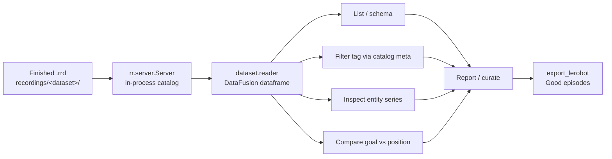

# Rerun Query API — reBot refine step

**Prize target:** Best example using the Rerun Query API  
**Code:** [`p5_rerun_port/rerun_query.py`](../../p5_rerun_port/rerun_query.py), [`query_api_cli.py`](../../p5_rerun_port/query_api_cli.py)  
**Runs:** after recording stops (read-only over `.rrd`). Does **not** open arms or the operator GUI.

## Pipeline

```text
record_episode (.rrd) → Query API (list / filter / inspect / compare) → export_lerobot
```



## Install

```bash
pip install -r requirements.txt
# pulls rerun-sdk[datafusion] + pandas
```

## Commands

```bash
# Schema + entity paths (exercises Query API)
python -m p5_rerun_port.query_api_cli --dataset cans --schema

# Inspect joint state via reader().to_pandas()
python -m p5_rerun_port.query_api_cli --dataset cans --entity follower/position

# Align follower/goal vs follower/position and score tracking error
python -m p5_rerun_port.query_api_cli --dataset cans --compare goal-vs-position

# Markdown report for judges
python -m p5_rerun_port.query_api_cli --dataset cans --compare goal-vs-position \
  --report docs/p5_rerun_port/examples/cans_query_report.md

# Same path via the older CLI flag
python -m p5_rerun_port.query_dataset --dataset cans --rerun-api --entity follower/position
```

## What makes this the Query API (not just file listing)

| Mechanism | Use |
|-----------|-----|
| `rr.server.Server(datasets={...})` | Load local `.rrd` into a catalog |
| `dataset.schema()` | Indexes, entities, component columns |
| `dataset.filter_contents([...])` | Restrict entities for row generation |
| `dataset.reader(index="time")` | DataFusion dataframe on the `time` timeline |
| `.to_pandas()` | Inspect / aggregate / compare in Python |

Catalog metadata (`catalog.json` tags) still lists episodes for curation; **series data** comes from the Rerun Query API over the `.rrd` bodies.

## Useful demo: goal vs position

`--compare goal-vs-position` pulls both series through the Query API, aligns rows, and prints per-joint mean/max absolute error plus RMS. High error → suspect lag or a bad take before export.

Sample report: [`examples/cans_query_report.md`](./examples/cans_query_report.md)

## Relationship to other bounties

| Prize | Role of this work |
|-------|-------------------|
| $1k non-SO-101 port | Strengthens the **Refine** step of `p5_rerun_port` |
| $2k Query API | This document + CLI is the submission surface |
| Operator GUI collection | Untouched — query after GUI or CLI recording |

## References

- [Dataframe queries](https://rerun.io/docs/concepts/query-and-transform/dataframe-queries)
- [Get data out](https://rerun.io/docs/howto/query-and-transform/get-data-out)
- SO-101 reference: [so100-hackathon](https://github.com/mission-robotics-ai/so100-hackathon) `query-dataset`
