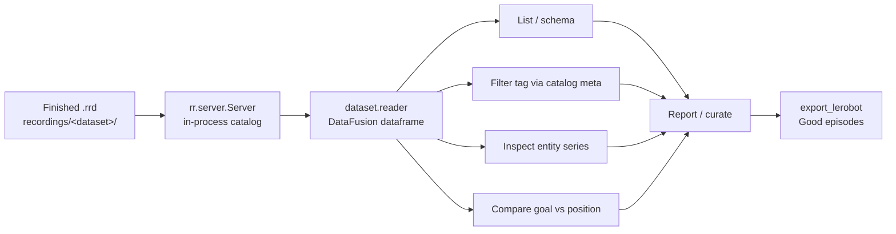

# Rerun Query API — reBot refine step

**Prize target:** Best example using the Rerun Query API  
**Code:** [`p5_rerun_port/rerun_query.py`](../../p5_rerun_port/rerun_query.py), [`query_api_cli.py`](../../p5_rerun_port/query_api_cli.py)

Post-recording only: read-only over `.rrd` files. Does **not** open arms or the operator GUI.

## Where this runs (important)

| Surface | Role |
|---------|------|
| **This Query API** | **Terminal / Python CLI** — `python -m p5_rerun_port.query_api_cli …` uses Rerun’s catalog + `dataset.reader()` (DataFusion) and prints tables/metrics (optional markdown report). |
| **Rerun Viewer** | Separate app for *looking* at an `.rrd` (`rerun recordings/cans/episode_01.rrd`). Not where Query API commands run. |
| **Operator Collect & train GUI** | Unrelated keep/fail LeRobot workflow. Untouched. |

```text
record_episode → .rrd on disk
       ↓
query_api_cli   ← you are here (terminal)
       ↓
optional: open the same .rrd in the Viewer to watch
       ↓
export_lerobot
```

## Pipeline

```text
record_episode (.rrd) → Query API CLI (list / filter / inspect / compare) → export_lerobot
```



## Prerequisites

1. Repo root as cwd (so `python -m p5_rerun_port…` resolves):

```bash
cd /path/to/DeskPartner
```

2. Deps (includes Query API extras):

```bash
pip install -r requirements.txt
# pulls rerun-sdk[datafusion] + pandas
```

3. At least one recorded episode under `recordings/<dataset>/` (e.g. `cans`). Dry-run if you have none yet:

```bash
python -m p5_rerun_port.record_episode \
  --fake --dataset cans --task "Pick one can and place in taped zone" \
  --tag "Good episode" --seconds 5 --no-viewer
```

That writes `recordings/cans/episode_XX.rrd` plus catalog sidecars. Query API reads the `.rrd` bodies; tags come from the local catalog.

## How to run (step by step)

All commands below are **terminal**. Replace `cans` if your dataset folder name differs.

### 1) List catalog + print Query API schema

```bash
python -m p5_rerun_port.query_api_cli --dataset cans --schema
```

Expect: a catalog table (episode / tag / frames), then schema text with timelines, entities (`follower/position`, `follower/goal`, cameras), and component columns.

### 2) Inspect one entity series

```bash
python -m p5_rerun_port.query_api_cli --dataset cans --entity follower/position
```

Optional filters:

```bash
# one episode only
python -m p5_rerun_port.query_api_cli --dataset cans --episode episode_01 --entity follower/position

# tag filter (catalog metadata)
python -m p5_rerun_port.query_api_cli --dataset cans --tag "Good episode" --entity follower/position
```

Expect: row count, frame count, first/last/mean joint vectors.

### 3) Compare goal vs position (tracking quality)

```bash
python -m p5_rerun_port.query_api_cli --dataset cans --compare goal-vs-position
```

Expect: per-joint mean/max absolute error and RMS. High error → suspect lag or a bad take before export.

### 4) Write a markdown report (for judges / demos)

```bash
python -m p5_rerun_port.query_api_cli --dataset cans --compare goal-vs-position \
  --report docs/p5_rerun_port/examples/cans_query_report.md
```

Sample output: [`examples/cans_query_report.md`](./examples/cans_query_report.md)

### 5) Optional — same path via older CLI flag

```bash
python -m p5_rerun_port.query_dataset --dataset cans --rerun-api --entity follower/position
```

Sidecar-only catalog listing (no Query API) remains:

```bash
python -m p5_rerun_port.query_dataset --dataset cans --tag "Good episode"
```

### 6) Optional — watch the same `.rrd` in the Viewer

```bash
rerun recordings/cans/episode_01.rrd
```

This is visualization only; it does not run Query API commands.

### 7) After curating — export good episodes

```bash
python -m p5_rerun_port.export_lerobot --dataset cans --tag "Good episode" --fallback
```

## CLI flags (cheat sheet)

| Flag | Purpose |
|------|---------|
| `--dataset` | Required. Folder name under `recordings/` |
| `--schema` | Print schema via Query API |
| `--entity` | Inspect series (e.g. `follower/position`) |
| `--compare goal-vs-position` | Align goal vs position; print error metrics |
| `--episode` | Limit to one episode id |
| `--tag` | Filter catalog rows by tag |
| `--report PATH` | Write markdown report |
| `--timeline` | Override reader index/timeline name |
| `--recordings-dir` / `--catalog` | Override default paths |

## What makes this the Query API (not just file listing)

| Mechanism | Use |
|-----------|-----|
| `rr.server.Server(datasets={...})` | Load local `.rrd` into a catalog |
| `dataset.schema()` | Indexes, entities, component columns |
| `dataset.filter_contents([...])` | Restrict entities for row generation |
| `dataset.reader(index="time")` | DataFusion dataframe on the `time` timeline |
| `.to_pandas()` | Inspect / aggregate / compare in Python |

Catalog metadata (`catalog.json` tags) still lists episodes for curation; **series data** comes from the Rerun Query API over the `.rrd` bodies.

## Relationship to other bounties

| Prize | Role of this work |
|-------|-------------------|
| $1k non-SO-101 port | Strengthens the **Refine** step of `p5_rerun_port` |
| $2k Query API | This document + CLI is the submission surface |
| Operator GUI collection | Untouched — query after GUI or CLI recording |

## References

- [Dataframe queries](https://rerun.io/docs/concepts/query-and-transform/dataframe-queries)
- [Get data out](https://rerun.io/docs/howto/query-and-transform/get-data-out)
- SO-101 reference: [so100-hackathon](https://github.com/mission-robotics-ai/so100-hackathon) `query-dataset`
