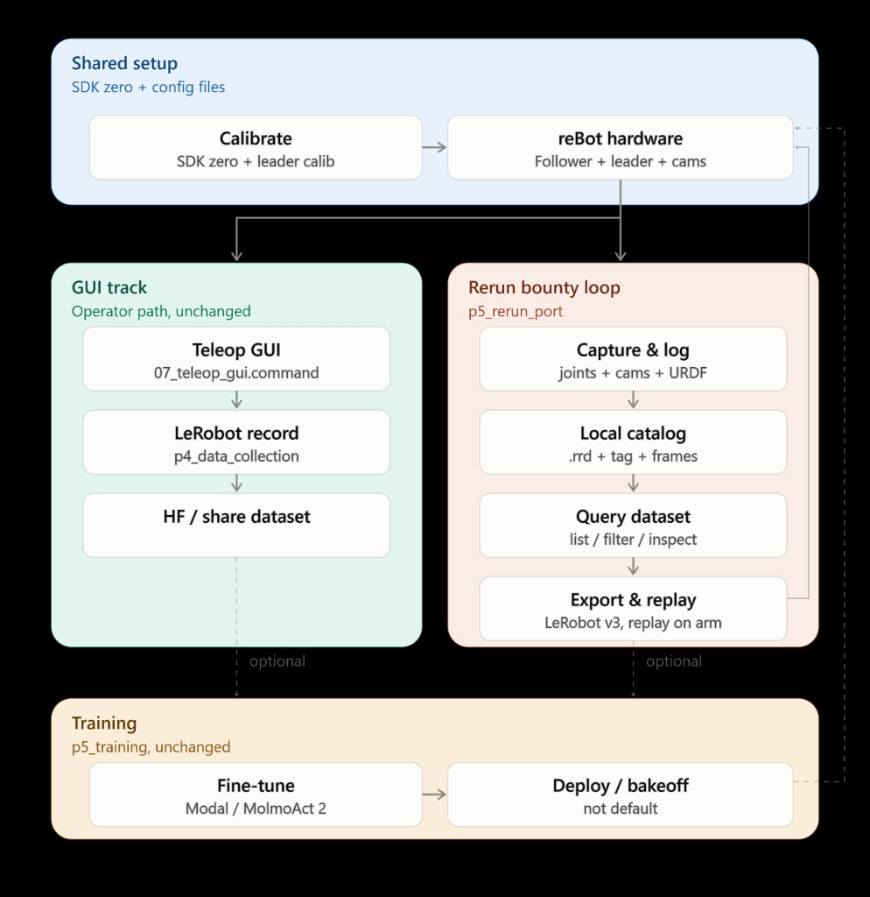
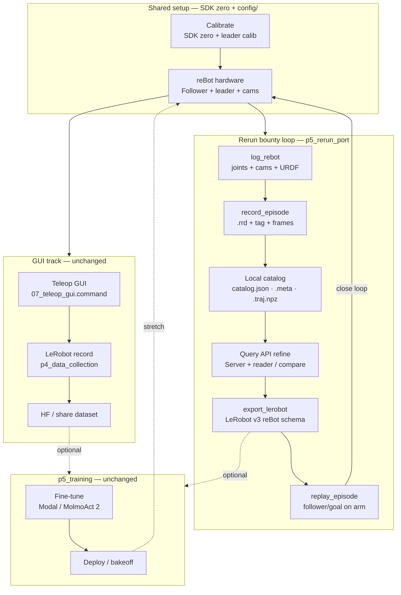

# p5_rerun_port — reBot end-to-end Rerun pipeline

Port of the [so100-hackathon](https://github.com/mission-robotics-ai/so100-hackathon) loop onto **reBot B601-DM + leader 102** for the non-SO-101 Rerun bounty.

**Progress tracker:** [`../Rerun_bounty_progress.md`](../Rerun_bounty_progress.md)  
**Code package:** [`../../p5_rerun_port/`](../../p5_rerun_port/)

```text
log_rebot → record_episode (.rrd) → Query API refine → export_lerobot → replay_episode
```

Leaves `p4_data_collection` (native LeRobot record) and `rebot_operator_kit` untouched. This package is the **Rerun → catalog → LeRobot v3 → replay** product shape — a **parallel** bounty path that shares hardware/config with the operator GUI track.

**Query API (post-record):** see [`QUERY_API.md`](./QUERY_API.md) — `python -m p5_rerun_port.query_api_cli`.

## How it connects (flowchart)





| Path | Role |
|------|------|
| **GUI track** | Day-to-day collection (`rebot_operator_kit` → LeRobot → share) |
| **Rerun loop** | Bounty product: Rerun recordings → curate → export → replay |
| **Training** | Same `p5_training` for either dataset source (optional) |

## Install

```bash
pip install -r requirements.txt
# optional for parquet fallback / richer export:
pip install pandas pyarrow
# venue live arms:
# Seeed LeRobot + lerobot-robot-seeed-b601 (see root README)
```

## One episode (dry-run, no arm)

```bash
# 1) Smoke: joints + fake cams + URDF → Rerun
python -m p5_rerun_port.log_rebot --fake --teleop --seconds 5 --no-viewer

# 2) Record episode → recordings/cans/episode_XX.rrd + catalog
python -m p5_rerun_port.record_episode \
  --fake --dataset cans --task "Pick one can and place in taped zone" \
  --tag "Good episode" --seconds 5 --no-viewer

# 3) Query / curate — Rerun Query API (after recording stops)
python -m p5_rerun_port.query_api_cli --dataset cans --schema
python -m p5_rerun_port.query_api_cli --dataset cans --entity follower/position
python -m p5_rerun_port.query_api_cli --dataset cans --compare goal-vs-position
# sidecar catalog listing still available:
python -m p5_rerun_port.query_dataset --dataset cans --tag "Good episode"

# 4) Export → LeRobot v3-shaped folder (reBot schema)
python -m p5_rerun_port.export_lerobot --dataset cans --tag "Good episode" --fallback

# 5) Replay trajectory (fake = print/send to fake session)
python -m p5_rerun_port.replay_episode --dataset cans --episode episode_01 --fake --speed 0.5 --no-viewer
```

Open any `.rrd` in the Rerun viewer: `rerun recordings/cans/episode_01.rrd`

## Venue (live arm)

Ports from `config/recording.yaml` / `config/arm.yaml`:

| Role | LeRobot type | Default port |
|------|----------------|--------------|
| Follower | `seeed_b601_dm_follower` | `/dev/ttyACM0` (`can_adapter=damiao`) |
| Leader | `rebot_arm_102_leader` | `/dev/ttyUSB0` |

```bash
# zero first (SDK)
cd ~/reBotArm_control_py && uv run python example/2_zero_and_read.py

python -m p5_rerun_port.log_rebot --teleop --seconds 20
python -m p5_rerun_port.record_episode --dataset cans --task "Pick one can..." --tag "Good episode"
python -m p5_rerun_port.export_lerobot --dataset cans --tag "Good episode"
python -m p5_rerun_port.replay_episode --dataset cans --episode episode_01 --speed 0.5
```

## Entity / schema conventions (SO-compatible)

| Entity | Meaning |
|--------|---------|
| `follower/position` | Observed joints (7) |
| `follower/goal` | Commanded / leader-mapped action (7) |
| `camera/cam0` | `front` (overhead) |
| `camera/cam1` | `side` (45°) |

Joints: `shoulder_pan`, `shoulder_lift`, `elbow_flex`, `wrist_flex`, `wrist_yaw`, `wrist_roll`, `gripper`

Export stamps `robot_type=seeed_b601_dm_follower` (not `so100_follower`).

## Local catalog

No `so100-server` required. Episodes register into:

- `recordings/catalog.json`
- `recordings/<dataset>/<episode>.meta.json`
- `recordings/<dataset>/<episode>.traj.npz` (action/state for export/replay)
- `recordings/<dataset>/<episode>/frames/{front,side}/*.jpg`

`.rrd` remains the Rerun artifact for inspection in the viewer.

## Diff vs SO-101

| SO-101 | reBot |
|--------|--------|
| Feetech `/dev/cu.usbmodem*` | Damiao CAN + USB leader |
| 6 joints | **7** (+ `wrist_yaw`) |
| portugal cal dual-write | SDK zero + `lerobot-calibrate` leader (documented) |
| gRPC catalog server | local `catalog.json` |
| `newt finetune` | use `p5_training` / Modal (unchanged) |

## Calibrate (good enough)

1. SDK: `example/2_zero_and_read.py`
2. Leader: `lerobot-calibrate --teleop.type=rebot_arm_102_leader --teleop.port=... --teleop.id=rebot_arm_102_leader`
3. Follower: place at zero / gripper closed per Seeed docs before first connect
